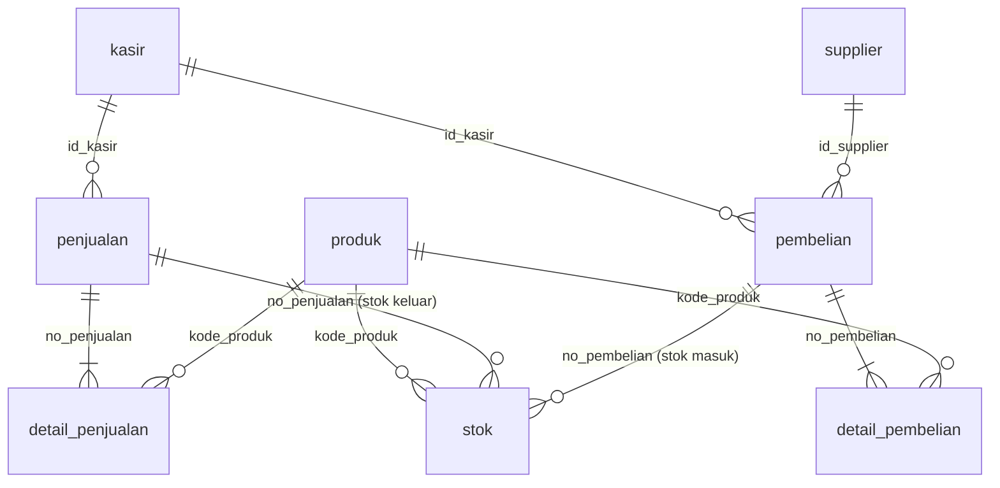

# Penjelasan Lengkap Query Database `penjualan_lengkap` (Toko Maju Jaya)

Panduan ini menjelaskan **semua** isi `semua_query_penjualan.md`, dari nol, untuk yang baru sedikit paham database. Cara pakainya:

1. Baca **Bagian 0** dan **Bagian 1** dulu supaya paham isi databasenya.
2. Setelah itu buka bagian A sampai M sesuai kebutuhan. Urutan bagiannya sama dengan file query.
3. Contoh hasil di sini diambil dari hasil jalan sungguhan di database ini, jadi bisa kamu cocokkan.

---

## Daftar Isi

- [0. Konsep dasar yang perlu dipahami](#0-konsep-dasar-yang-perlu-dipahami)
- [1. Kenalan dengan database Toko Maju Jaya](#1-kenalan-dengan-database-toko-maju-jaya)
- [2. Cara menjalankan query](#2-cara-menjalankan-query)
- [A. SELECT dasar](#a-select-dasar)
- [B. Filter dan urutan](#b-filter-dan-urutan)
- [C. Agregat dan GROUP BY](#c-agregat-dan-group-by)
- [D. JOIN](#d-join)
- [E. Subquery, EXISTS, CTE, UNION](#e-subquery-exists-cte-union)
- [F. Laporan penjualan](#f-laporan-penjualan)
- [G. Laporan pembelian](#g-laporan-pembelian)
- [H. Stok dan kartu stok](#h-stok-dan-kartu-stok)
- [I. Tugas 1 sampai 5](#i-tugas-1-sampai-5)
- [J. Window function](#j-window-function)
- [K. Validasi data](#k-validasi-data)
- [L. VIEW](#l-view)
- [M. INSERT, UPDATE, DELETE](#m-insert-update-delete)
- [Kesalahan umum pemula](#kesalahan-umum-pemula)
- [Kamus istilah](#kamus-istilah)

---

## 0. Konsep dasar yang perlu dipahami

### Database, tabel, baris, kolom

- **Database** = satu "lemari besar" yang menyimpan banyak tabel. Di sini namanya `penjualan_lengkap`.
- **Tabel** = satu "buku tulis" berisi data sejenis. Contoh: tabel `kasir` isinya daftar kasir.
- **Kolom** (field) = judul kolom di buku tulis itu. Contoh: `nama_kasir`, `status`.
- **Baris** (record) = satu isian data. Contoh: satu baris untuk kasir "Anna".

Contoh tabel `kasir`:

| id_kasir | nama_kasir | status | tanggal_keluar |
|---|---|---|---|
| 1 | Anna | aktif | NULL |
| 2 | Budi | nonaktif | 2026-09-15 |

### Tipe data yang dipakai

| Tipe | Artinya | Contoh |
|---|---|---|
| `INT` | bilangan bulat | `jumlah = 3` |
| `VARCHAR(50)` | teks maksimal 50 huruf | `'Anna'` |
| `DECIMAL(10,2)` | angka desimal, total 10 digit, 2 di belakang koma. Cocok untuk uang | `4200.00` |
| `DATE` | tanggal format `TAHUN-BULAN-TANGGAL` | `'2026-09-10'` |
| `ENUM('aktif','nonaktif')` | hanya boleh salah satu dari pilihan | `'aktif'` |

### PRIMARY KEY dan AUTO_INCREMENT

- **PRIMARY KEY** = kolom "kartu identitas" tiap baris. Nilainya tidak boleh kembar dan tidak boleh kosong. Contoh: `kode_produk`, `no_penjualan`.
- **AUTO_INCREMENT** = nomor naik otomatis (1, 2, 3, ...). Kamu tidak perlu mengisinya sendiri.

### NULL

`NULL` artinya **kosong / tidak ada nilai**. Bukan angka 0 dan bukan teks kosong. Karena itu mengeceknya harus pakai `IS NULL`, **bukan** `= NULL`.

### Relasi tanpa FOREIGN KEY

Pada tabel penjualan, kolom `id_kasir` berisi angka yang "menunjuk" ke tabel `kasir`. Itulah **relasi**. File ini sengaja **tidak memakai FOREIGN KEY** (aturan penjaga relasi), jadi hubungan antar tabel dibuktikan lewat **JOIN**. Akibatnya database tidak akan menolak kalau ada data yatim (menunjuk ke data yang tidak ada). Itu sebabnya ada Bagian K untuk mengecek sendiri.

### Pola header dan detail

Satu nota belanja punya dua bagian:

- **Header** (kepala): nomor nota, tanggal, kasir, cara bayar. Ada di tabel `penjualan`.
- **Detail** (isi): daftar barang yang dibeli, satu baris per barang. Ada di tabel `detail_penjualan`.

Hubungannya **satu header punya banyak detail**. Penghubungnya adalah `no_penjualan`. Pola yang sama dipakai di `pembelian` dan `detail_pembelian`. Total nota **tidak disimpan**, tapi dihitung dari detail (`jumlah x harga_satuan`).

### Snapshot (foto harga saat transaksi)

Di `detail_penjualan` ada kolom `nama_produk` dan `harga_satuan` yang **menyalin** nama dan harga produk **pada saat transaksi**. Tujuannya: kalau nanti harga di tabel `produk` naik, nota lama **tidak ikut berubah**. Bayangkan struk belanja: harga di struk kemarin tidak berubah walau hari ini harga barangnya naik.

### Soft delete

Kalau kasir berhenti kerja, barisnya **tidak dihapus**. Yang diubah cuma `status` jadi `'nonaktif'` dan `tanggal_keluar` diisi. Kenapa? Karena nota-nota lama kasir itu masih menunjuk ke dia. Kalau barisnya dihapus, nota lama jadi "yatim".

### Kartu stok

Tabel `stok` itu seperti **buku tabungan** untuk tiap barang. Setiap barang ada riwayat: barang masuk (setoran), barang keluar (penarikan), dan **saldo** setelahnya. Baris pertama tiap barang adalah "Stok awal".

### Urutan SQL dijalankan (penting untuk mengerti hasilnya)

Walau kita menulis `SELECT` di awal, MySQL memprosesnya dengan urutan ini:

```
FROM / JOIN  ->  WHERE  ->  GROUP BY  ->  HAVING  ->  SELECT  ->  ORDER BY  ->  LIMIT
```

Makanya `WHERE` tidak bisa memakai alias yang dibuat di `SELECT`, dan `HAVING` dipakai untuk menyaring hasil `GROUP BY`.

---

## 1. Kenalan dengan database Toko Maju Jaya

### Isi 8 tabel

| Tabel | Fungsi | Jumlah baris |
|---|---|---|
| `kasir` | daftar kasir. Soft delete lewat `status` | 4 |
| `supplier` | pemasok barang | 3 |
| `produk` | katalog barang (master): harga beli, harga jual, stok awal | 20 |
| `penjualan` | header nota penjualan | 14 |
| `detail_penjualan` | isi nota penjualan (dengan snapshot) | 41 |
| `pembelian` | header pembelian ke supplier | 4 |
| `detail_pembelian` | isi pembelian (dengan snapshot) | 30 |
| `stok` | kartu stok semua barang | 91 |

### Peta hubungan antar tabel



Cara membaca: `kasir ||--o{ penjualan` artinya satu kasir bisa punya banyak nota penjualan. Kalau diagram Mermaid tidak tampil di aplikasimu, lihat tabel berikut yang isinya sama:

| Kolom penghubung | Tabel asal | Menunjuk ke |
|---|---|---|
| `id_kasir` | `penjualan`, `pembelian` | `kasir` |
| `id_supplier` | `pembelian` | `supplier` |
| `no_penjualan` | `detail_penjualan`, `stok` | `penjualan` |
| `no_pembelian` | `detail_pembelian`, `stok` | `pembelian` |
| `kode_produk` | `detail_penjualan`, `detail_pembelian`, `stok` | `produk` |

### Cerita di balik datanya

1. **Produk BRG001 berubah.** Awalnya bernama "Indomie Goreng" seharga 3.500. Pada **10 September 2026** berubah jadi "Indomie Goreng Rasa Ayam" seharga 4.200. Tabel `produk` sudah menyimpan versi **baru**. Nota sebelum 10 Sep menyimpan versi **lama** di `detail_penjualan` (snapshot).
2. **Kasir Budi di-PHK** pada 15 September 2026, jadi statusnya `nonaktif` (soft delete). Nota-nota Budi (PJ-0002, PJ-0003, PJ-0007) tetap utuh.
3. **Stok** dicatat per barang. Tiap barang dibuka dengan "Stok awal" tanggal 31 Agustus, lalu mutasi urut tanggal. Kalau tanggalnya sama, barang masuk (pembelian) dicatat lebih dulu daripada barang keluar (penjualan).

### Ringkasan angka penting (dari hasil query)

| Hal | Nilai |
|---|---|
| Total omzet penjualan | Rp 658.000 |
| Total unit terjual | 68 unit |
| Total belanja ke supplier | Rp 5.307.500 |
| Laba kotor (perkiraan) | Rp 116.000 |
| Produk yang belum pernah terjual | 1 (BRG009 Roti Sobek Cokelat) |

---

## 2. Cara menjalankan query

**Di phpMyAdmin:**

1. Impor/tempel `bangun_database_penjualan.sql` dulu supaya database dan datanya jadi.
2. Klik database `penjualan_lengkap` di panel kiri, lalu buka tab **SQL**.
3. Tempel **satu query saja**, lalu klik **Kirim / Go**.

**Tips:**

- Setiap query diakhiri titik koma `;`.
- Kalau kamu menempel banyak query sekaligus, phpMyAdmin biasanya hanya menampilkan hasil **query terakhir**. Jadi tempel satu-satu supaya hasilnya terlihat.
- Baris yang diawali `--` adalah **komentar**. Tidak dijalankan, hanya catatan.
- Query SELECT **aman**: hanya membaca, tidak mengubah data. Yang mengubah data hanya `INSERT`, `UPDATE`, `DELETE`, `TRUNCATE`, dan `CREATE VIEW` (ada di Bagian L dan M).

---

## A. SELECT dasar

`SELECT` artinya "tampilkan data". Bentuk paling dasar:

```sql
SELECT kolom FROM tabel;
```

### A1. Lihat semua isi tabel

```sql
SELECT * FROM kasir;
```

- `*` artinya **semua kolom**.
- `FROM kasir` artinya dari tabel `kasir`.
- Hasilnya semua baris dan semua kolom. Ada 8 query seperti ini, satu per tabel. Berguna untuk "mengintip" isi tabel.

> Untuk tabel besar seperti `stok` (91 baris), sebaiknya tambah `LIMIT 10` supaya tidak kepanjangan.

### A2. Lihat struktur tabel

```sql
SHOW TABLES;      -- daftar semua tabel di database
DESCRIBE produk;  -- kolom, tipe data, PRIMARY KEY, default tiap kolom
```

`DESCRIBE` menjawab pertanyaan "tabel ini punya kolom apa saja dan tipenya apa". Ada versi untuk 8 tabel.

### A3. Memilih kolom tertentu dan alias

```sql
SELECT kode_produk AS kode, nama_produk AS nama, harga_jual AS harga FROM produk;
```

- Hanya 3 kolom yang ditampilkan.
- `AS kode` memberi **nama sementara** (alias) pada judul kolom hasil. Tabel aslinya tidak berubah.

### A4. Nilai unik dengan DISTINCT

```sql
SELECT DISTINCT metode_bayar FROM penjualan;
```

`DISTINCT` membuang nilai kembar. Hasilnya cuma daftar jenisnya: Tunai, QRIS, Debit. Tanpa `DISTINCT` kamu akan melihat 14 baris (satu per nota).

### A5. Kolom hasil hitungan

```sql
SELECT kode_produk, nama_produk, harga_beli, harga_jual,
       harga_jual - harga_beli                                AS margin_rp,
       ROUND((harga_jual - harga_beli) / harga_beli * 100, 2) AS margin_persen
FROM produk;
```

- Kamu bisa menghitung langsung di `SELECT`. Hasilnya muncul sebagai kolom baru.
- `margin_rp` = untung per barang. `margin_persen` = untungnya berapa persen dari modal.
- `ROUND(x, 2)` membulatkan ke 2 angka di belakang koma.
- Contoh BRG001: 4200 - 2500 = **1.700** dan 1700 / 2500 x 100 = **68%**.

---

## B. Filter dan urutan

### B1. WHERE dengan perbandingan

`WHERE` = "hanya ambil baris yang memenuhi syarat".

```sql
SELECT * FROM produk WHERE harga_jual > 10000;
```

| Operator | Artinya |
|---|---|
| `=` | sama dengan (satu tanda sama, bukan dua) |
| `<>` atau `!=` | tidak sama dengan |
| `>` `<` | lebih besar / lebih kecil |
| `>=` `<=` | lebih besar sama dengan / lebih kecil sama dengan |

Teks dan tanggal harus diapit tanda kutip satu: `'BRG001'`, `'2026-09-10'`.

### B2. AND, OR, NOT

```sql
SELECT * FROM produk WHERE harga_jual > 5000 AND stok_awal < 30;
```

- `AND` = **kedua** syarat harus benar.
- `OR` = **salah satu** cukup.
- `NOT (...)` = kebalikan syarat di dalam kurung.

### B3. BETWEEN (rentang)

```sql
SELECT * FROM produk WHERE harga_jual BETWEEN 5000 AND 15000;
SELECT * FROM penjualan WHERE tanggal BETWEEN '2026-09-01' AND '2026-09-10';
```

`BETWEEN a AND b` artinya dari a sampai b, **batas a dan b ikut termasuk**.

### B4. IN dan NOT IN (daftar pilihan)

```sql
SELECT * FROM penjualan WHERE metode_bayar IN ('QRIS', 'Debit');
```

Sama dengan `metode_bayar = 'QRIS' OR metode_bayar = 'Debit'`, tapi lebih ringkas. `NOT IN` kebalikannya.

### B5. LIKE (cari teks)

| Pola | Artinya | Contoh cocok |
|---|---|---|
| `'Indomie%'` | diawali "Indomie" | Indomie Goreng, Indomie Kuah Soto |
| `'%Goreng%'` | mengandung "Goreng" di mana saja | Indomie Goreng, Mi Sedaap Goreng, Minyak Goreng 1 L |
| `'%ml'` | diakhiri "ml" | Teh Botol Sosro 350ml, Aqua Botol 600ml |

`%` = "teks apa saja, panjang berapa pun". Query terakhir di bagian ini, `LIKE 'Indomie Goreng%'` pada `detail_penjualan`, menangkap **nama lama dan nama baru** BRG001 sekaligus.

### B6. IS NULL dan IS NOT NULL

```sql
SELECT * FROM kasir WHERE tanggal_keluar IS NULL;
```

- Kasir yang `tanggal_keluar`-nya kosong = masih bekerja.
- Di tabel `stok`: `no_penjualan IS NOT NULL` = baris stok **keluar** karena penjualan. `no_pembelian IS NOT NULL` = stok **masuk** karena pembelian. Kalau dua-duanya NULL = baris "Stok awal".

### B7. Kasir aktif dan nonaktif

```sql
SELECT * FROM kasir WHERE status = 'aktif';
```

Hasil: Anna, Citra, Dewi. Yang nonaktif: Budi.

### B8. ORDER BY (mengurutkan)

```sql
SELECT * FROM produk ORDER BY harga_jual DESC, nama_produk ASC;
```

- `ASC` = naik (kecil ke besar, A ke Z). Ini default.
- `DESC` = turun (besar ke kecil, Z ke A).
- Boleh banyak kolom: kalau kolom pertama sama, dilihat kolom kedua.

### B9. LIMIT dan OFFSET

```sql
SELECT * FROM produk ORDER BY harga_jual DESC LIMIT 5;             -- 5 termahal
SELECT * FROM produk ORDER BY harga_jual DESC LIMIT 5 OFFSET 5;    -- halaman ke-2
```

- `LIMIT 5` = ambil 5 baris saja.
- `OFFSET 5` = lewati 5 baris pertama. Dipakai untuk membuat halaman (pagination).
- Jangan lupa `ORDER BY`. Tanpa urutan, "5 teratas" tidak jelas maksudnya.

### B10. Filter tanggal

| Query | Maksudnya |
|---|---|
| `WHERE tanggal = '2026-09-02'` | tepat pada tanggal itu |
| `WHERE tanggal >= '2026-09-10'` | tanggal itu dan sesudahnya |
| `WHERE tanggal < '2026-09-10'` | sebelum tanggal itu |
| `WHERE MONTH(tanggal) = 9 AND YEAR(tanggal) = 2026` | ambil bulan 9 tahun 2026 |
| `SELECT *, DAYNAME(tanggal) AS hari ...` | tambah kolom nama hari (Monday, dst.) |
| `WHERE DAYOFWEEK(tanggal) IN (1, 7)` | hari Minggu (1) dan Sabtu (7) |

Fungsi tanggal yang berguna: `YEAR()`, `MONTH()`, `DAY()`, `DAYNAME()`, `DAYOFWEEK()`, `DATE_FORMAT()`.

---

## C. Agregat dan GROUP BY

**Fungsi agregat** = fungsi yang **meringkas banyak baris jadi satu angka**.

| Fungsi | Fungsinya |
|---|---|
| `COUNT(*)` | menghitung jumlah baris |
| `COUNT(DISTINCT kolom)` | menghitung jumlah nilai unik |
| `SUM(kolom)` | menjumlahkan |
| `AVG(kolom)` | rata-rata |
| `MIN(kolom)` / `MAX(kolom)` | terkecil / terbesar |

### C1. Agregat sederhana

```sql
SELECT SUM(jumlah * harga_satuan) AS total_omzet FROM detail_penjualan;
```

Tiap baris detail dihitung `jumlah x harga_satuan` (subtotal), lalu semuanya dijumlah. Hasil: **Rp 658.000**.

Hasil lain yang bisa kamu dapat:

| Query | Hasil |
|---|---|
| jumlah produk | 20 |
| jumlah nota | 14 |
| total unit terjual | 68 |
| produk yang pernah terjual | 19 (BRG009 tidak pernah) |

### C2. GROUP BY (mengelompokkan)

```sql
SELECT metode_bayar, COUNT(*) AS jumlah_nota
FROM penjualan GROUP BY metode_bayar;
```

Cara kerjanya: baris-baris dikumpulkan ke "keranjang" menurut `metode_bayar`, lalu `COUNT(*)` dihitung **per keranjang**.

| metode_bayar | jumlah_nota |
|---|---|
| Tunai | 9 |
| QRIS | 3 |
| Debit | 2 |

**Aturan emas:** kolom biasa di `SELECT` (yang bukan fungsi agregat) **harus** ada di `GROUP BY`.

### C3. HAVING (filter hasil kelompok)

```sql
SELECT kode_produk, SUM(jumlah) AS total_terjual
FROM detail_penjualan GROUP BY kode_produk
HAVING SUM(jumlah) >= 5;
```

- `WHERE` menyaring **baris** sebelum dikelompokkan.
- `HAVING` menyaring **kelompok** sesudah dikelompokkan.
- Maka syarat yang memakai `SUM`, `COUNT`, dst. harus di `HAVING`, bukan `WHERE`.

### C4. GROUP BY lebih dari satu kolom

```sql
SELECT id_kasir, metode_bayar, COUNT(*) FROM penjualan GROUP BY id_kasir, metode_bayar;
```

Kelompoknya jadi per kombinasi, misalnya "Anna + Tunai", "Anna + QRIS", dst.

### C5. WITH ROLLUP

```sql
SELECT metode_bayar, COUNT(*) FROM penjualan GROUP BY metode_bayar WITH ROLLUP;
```

Menambah **satu baris total** di akhir (baris dengan `metode_bayar = NULL` berisi total 14).

---

## D. JOIN

**JOIN = menyambung dua tabel atau lebih** lewat kolom penghubung, supaya data yang tersebar bisa dibaca bersama.

Contoh masalah: tabel `penjualan` hanya punya `id_kasir = 1`. Kita ingin tahu namanya, yang ada di tabel `kasir`.

```sql
SELECT p.no_penjualan, p.tanggal, k.nama_kasir, p.metode_bayar
FROM penjualan p
JOIN kasir k ON k.id_kasir = p.id_kasir;
```

- `penjualan p` = beri nama pendek `p` untuk tabel itu (alias tabel).
- `JOIN kasir k ON k.id_kasir = p.id_kasir` = sambungkan baris yang `id_kasir`-nya sama.

### Jenis-jenis JOIN

| Jenis | Hasilnya |
|---|---|
| `JOIN` / `INNER JOIN` | hanya baris yang **cocok di kedua tabel** |
| `LEFT JOIN` | **semua** baris tabel kiri, plus yang cocok dari kanan (kalau tidak ada, kolom kanan `NULL`) |
| `RIGHT JOIN` | kebalikan LEFT JOIN |
| `CROSS JOIN` | **semua kombinasi** (tiap baris kiri dipasangkan ke tiap baris kanan) |

### D1. Nota + nama kasir

Contoh di atas. Hasilnya 14 baris, setiap nota disertai nama kasirnya.

### D2. Pembelian + kasir + supplier

JOIN tiga tabel sekaligus: `pembelian` ke `kasir` dan ke `supplier`. Setiap `JOIN ... ON ...` baru menambah satu tabel.

### D3. Nota lengkap (header + detail + kasir)

Menyambung `penjualan`, `kasir`, dan `detail_penjualan`, plus kolom hitungan `subtotal = jumlah x harga_satuan`. Hasilnya 41 baris (jumlah baris detail), karena satu nota yang punya 3 barang tampil 3 kali.

### D4. Pembelian lengkap

Sama seperti D3 tapi untuk pembelian: header, supplier, kasir, dan detail (30 baris).

### D5. Detail + master produk (bandingkan snapshot dan master)

Menyambung `detail_penjualan` ke `produk` lewat `kode_produk`. Hasilnya menampilkan **dua versi** sekaligus: `nama_snapshot` (waktu transaksi) dan `nama_master_sekarang`. Untuk BRG001 di nota PJ-0001 kamu akan lihat snapshot "Indomie Goreng" dan master "Indomie Goreng Rasa Ayam".

### D6. LEFT JOIN: semua produk termasuk yang belum terjual

```sql
SELECT pr.kode_produk, pr.nama_produk, COALESCE(SUM(d.jumlah), 0) AS total_terjual
FROM produk pr
LEFT JOIN detail_penjualan d ON d.kode_produk = pr.kode_produk
GROUP BY pr.kode_produk, pr.nama_produk
ORDER BY total_terjual DESC;
```

- Karena `LEFT JOIN`, produk yang **tidak pernah terjual tetap muncul** (dengan data kanan `NULL`).
- `COALESCE(x, 0)` = "kalau x kosong (NULL), pakai 0". Tanpa ini, BRG009 menampilkan NULL, bukan 0.
- Kalau memakai `INNER JOIN`, BRG009 hilang dari hasil.

### D7. LEFT JOIN + IS NULL (cari yang "tidak punya pasangan")

```sql
SELECT pr.kode_produk, pr.nama_produk
FROM produk pr
LEFT JOIN detail_penjualan d ON d.kode_produk = pr.kode_produk
WHERE d.id_detail IS NULL;
```

Trik ini sangat sering dipakai: LEFT JOIN, lalu ambil baris yang sisi kanannya kosong. Artinya "produk yang tidak punya satu pun baris penjualan". Hasil: **BRG009 Roti Sobek Cokelat**.

### D8 sampai D11. Variasi cari yang tidak punya pasangan

| Query | Menjawab |
|---|---|
| D8 | produk yang belum pernah dibeli dari supplier |
| D9 | kasir yang belum pernah membuat nota penjualan |
| D10 | kasir yang belum pernah melakukan pembelian (kasir Budi, misalnya) |
| D11 | supplier + jumlah pembelian, termasuk yang 0 |

`COUNT(b.no_pembelian)` pada D11 menghitung hanya yang tidak NULL, sehingga supplier tanpa pembelian terhitung 0 (kalau pakai `COUNT(*)` hasilnya salah jadi 1).

### D12. RIGHT JOIN

Isinya sama dengan D6, hanya urutan tabelnya dibalik. Di praktik hampir semua orang memakai LEFT JOIN, jadi RIGHT JOIN cukup diketahui saja.

### D13. FULL OUTER JOIN lewat UNION

MySQL tidak punya `FULL OUTER JOIN`. Triknya: gabungkan hasil `LEFT JOIN` dan `RIGHT JOIN` memakai `UNION`. Hasilnya = semua baris dari kedua sisi, cocok maupun tidak.

### D14. SELF JOIN (tabel disambung dengan dirinya sendiri)

```sql
FROM penjualan a
JOIN penjualan b ON a.tanggal = b.tanggal
                AND a.no_penjualan < b.no_penjualan
                AND a.id_kasir <> b.id_kasir
```

Tabel `penjualan` dipakai dua kali (alias `a` dan `b`) untuk mencari **pasangan nota di hari yang sama tapi kasirnya beda**. Syarat `a.no_penjualan < b.no_penjualan` mencegah pasangan muncul dua kali (A-B dan B-A) atau memasangkan nota dengan dirinya sendiri.

### D15. CROSS JOIN

Semua kombinasi kasir x metode bayar (4 x 3 = 12 baris), termasuk kombinasi yang tidak pernah terjadi. Berguna untuk membuat kerangka tabel laporan.

### D16. Kartu stok + nama produk

Menyambung `stok` ke `produk` supaya kartu stok memuat nama barang, bukan hanya kodenya. Diurutkan per `kode_produk` lalu `id_stok` agar riwayatnya runut.

---

## E. Subquery, EXISTS, CTE, UNION

**Subquery** = query di dalam query lain, ditulis di dalam tanda kurung. Dikerjakan **lebih dulu**, hasilnya dipakai query luar.

### E1. Lebih mahal dari rata-rata

```sql
SELECT * FROM produk
WHERE harga_jual > (SELECT AVG(harga_jual) FROM produk);
```

1. Subquery menghitung rata-rata harga jual semua produk.
2. Query luar mengambil produk yang harganya di atas angka itu.

### E2. Produk termahal

Sama pola: `harga_jual = (SELECT MAX(harga_jual) FROM produk)`. Hasil: Beras 5 kg (62.000). Cara ini lebih tepat dibanding `ORDER BY ... LIMIT 1` kalau ada beberapa produk yang harganya sama-sama tertinggi.

### E3. Nota di atas rata-rata

Subquery bertingkat: dalam menghitung total per nota, lapisan tengah merata-ratakannya, lalu `HAVING` memilih nota di atas rata-rata. Bentuk `(...) x` memberi alias pada subquery yang dipakai sebagai tabel sementara. Di MySQL aliasnya **wajib**.

### E4 dan E5. IN dan NOT IN dengan subquery

```sql
WHERE kode_produk IN (SELECT DISTINCT kode_produk FROM detail_penjualan)
WHERE kode_produk NOT IN (SELECT DISTINCT kode_produk FROM detail_penjualan)
```

E4 = produk yang pernah terjual. E5 = yang tidak pernah (BRG009).

> **Hati-hati:** `NOT IN` memberi hasil kosong kalau daftar di dalamnya mengandung `NULL`. Di sini aman karena `kode_produk` tidak pernah kosong. Cara paling aman tetap `LEFT JOIN ... IS NULL` (D7) atau `NOT EXISTS`.

### E6 dan E7. EXISTS dan NOT EXISTS

```sql
SELECT * FROM kasir k
WHERE EXISTS (SELECT 1 FROM penjualan p
              WHERE p.id_kasir = k.id_kasir AND p.metode_bayar = 'QRIS');
```

- Untuk **setiap kasir**, MySQL bertanya: "ada tidak nota QRIS milik kasir ini?".
- Subquery ini merujuk `k.id_kasir` dari query luar, namanya **correlated subquery**.
- `SELECT 1` hanya formalitas. Yang penting ada barisnya atau tidak.
- E7 (`NOT EXISTS`) kebalikannya: kasir yang tidak pernah menerima pembayaran QRIS.

### E8. Subquery di dalam SELECT

Menampilkan total terjual untuk **tiap produk** lewat subquery per baris. Hasilnya sama dengan D6, hanya cara menulisnya berbeda.

### E9. Nota yang berisi BRG001

```sql
WHERE no_penjualan IN (SELECT no_penjualan FROM detail_penjualan WHERE kode_produk = 'BRG001')
```

Subquery mencari nomor nota yang memuat BRG001, lalu query luar menampilkan header nota itu.

### E10. Nota yang berisi BRG001 **dan** BRG003 sekaligus

```sql
SELECT no_penjualan FROM detail_penjualan
WHERE kode_produk IN ('BRG001', 'BRG003')
GROUP BY no_penjualan
HAVING COUNT(DISTINCT kode_produk) = 2;
```

Ambil dulu baris BRG001 atau BRG003, kelompokkan per nota, lalu simpan hanya nota yang punya **2 jenis berbeda**. Hasil: PJ-0001, PJ-0008, dan PJ-0014 (ketiganya memuat BRG001 dan BRG003).

### E11. CTE (WITH)

```sql
WITH total_nota AS (
  SELECT no_penjualan, SUM(jumlah * harga_satuan) AS total
  FROM detail_penjualan GROUP BY no_penjualan
)
SELECT p.no_penjualan, p.tanggal, k.nama_kasir, t.total
FROM total_nota t
JOIN penjualan p ON p.no_penjualan = t.no_penjualan
JOIN kasir k     ON k.id_kasir     = p.id_kasir
ORDER BY t.total DESC;
```

CTE = "tabel sementara bernama" yang dibuat di bagian `WITH`, lalu dipakai seperti tabel biasa. Hasilnya sama dengan subquery, tapi **jauh lebih mudah dibaca** karena dipecah per langkah. Dipakai hanya untuk query ini.

### E12. UNION dan UNION ALL

```sql
SELECT tanggal, no_penjualan AS no_transaksi, 'Penjualan' AS jenis FROM penjualan
UNION ALL
SELECT tanggal, no_pembelian, 'Pembelian' FROM pembelian
ORDER BY tanggal, no_transaksi;
```

`UNION` **menumpuk hasil dua query ke bawah**. Syaratnya jumlah dan urutan kolom harus sama. `UNION` membuang baris kembar, sedangkan `UNION ALL` menyimpan semuanya (lebih cepat). Di sini hasilnya satu daftar semua transaksi (18 baris), baik penjualan maupun pembelian.

---

## F. Laporan penjualan

Sebagian besar laporan di sini memakai pola: **JOIN + SUM(jumlah x harga_satuan) + GROUP BY**.

### F1. Total tiap nota

```sql
SELECT p.no_penjualan, p.tanggal, k.nama_kasir, p.metode_bayar,
       COUNT(d.id_detail)             AS jenis_barang,
       SUM(d.jumlah)                  AS total_unit,
       SUM(d.jumlah * d.harga_satuan) AS total_nota
FROM penjualan p
JOIN kasir k            ON k.id_kasir     = p.id_kasir
JOIN detail_penjualan d ON d.no_penjualan = p.no_penjualan
GROUP BY p.no_penjualan, p.tanggal, k.nama_kasir, p.metode_bayar
ORDER BY p.no_penjualan;
```

Total nota **tidak disimpan** di tabel, tapi dihitung dari detail. Hasil total per nota:

| Nota | Total | | Nota | Total |
|---|---:|---|---|---:|
| PJ-0001 | 40.000 | | PJ-0008 | 38.600 |
| PJ-0002 | 72.500 | | PJ-0009 | 25.900 |
| PJ-0003 | 48.000 | | PJ-0010 | 133.000 |
| PJ-0004 | 21.600 | | PJ-0011 | 26.400 |
| PJ-0005 | 29.600 | | PJ-0012 | 28.100 |
| PJ-0006 | 28.500 | | PJ-0013 | 48.100 |
| PJ-0007 | 71.500 | | PJ-0014 | 46.200 |

Cek manual PJ-0001: Indomie Goreng 2 x 3.500 = 7.000, Teh Botol 1 x 5.000 = 5.000, Telur 1 x 28.000 = 28.000. Jumlah = **40.000**.

### F2. Omzet harian

Dikelompokkan per `tanggal`. `COUNT(DISTINCT p.no_penjualan)` dipakai karena setelah JOIN dengan detail, satu nota muncul beberapa kali. Tanpa `DISTINCT` jumlah notanya akan membengkak.

### F3. Omzet per kasir

| Kasir | Jumlah nota | Omzet |
|---|---:|---:|
| Anna | 5 | 271.200 |
| Budi | 3 | 192.000 |
| Citra | 4 | 140.800 |
| Dewi | 2 | 54.000 |

Total 658.000, sama dengan omzet keseluruhan. Budi tetap muncul walau nonaktif, karena notanya ada.

### F4. Omzet per metode bayar

| Metode | Jumlah nota | Omzet |
|---|---:|---:|
| Tunai | 9 | 487.800 |
| QRIS | 3 | 114.700 |
| Debit | 2 | 55.500 |

### F5. Omzet per produk

Dikelompokkan per produk memakai `kode_produk` (bukan `nama_produk` snapshot), supaya BRG001 yang namanya berubah tetap terhitung **satu produk**. Nama diambil dari master `produk`.

### F6. 5 produk terlaris

| Peringkat | Produk | Unit terjual |
|---|---|---:|
| 1 | Indomie Goreng Rasa Ayam (BRG001) | 12 |
| 2 | Aqua Botol 600ml (BRG004) | 9 |
| 3-5 | Teh Botol, Energen, Indomie Kuah Soto | 5 (seri) |

Catatan: peringkat 3 sampai 5 seri di angka 5, jadi urutan di antara ketiganya bisa berubah. Kalau perlu urutan pasti, tambahkan kolom kedua di `ORDER BY`, misalnya `ORDER BY unit_terjual DESC, pr.kode_produk`.

### F7. 5 produk paling sedikit terjual

Sama dengan F6 tapi `ASC`. Hanya produk yang **pernah terjual**. Produk yang tidak pernah terjual ada di D7.

### F8. Nota terbesar dan terkecil

`ORDER BY total DESC LIMIT 1` = nota terbesar (**PJ-0010, 133.000**). `ASC LIMIT 1` = terkecil (**PJ-0004, 21.600**).

### F9. Rata-rata nilai per nota

Dua langkah: (1) hitung total tiap nota di subquery, (2) rata-ratakan. Tidak bisa langsung `AVG(SUM(...))` di MySQL. Hasil: 658.000 / 14 = **47.000**.

### F10. Laba kotor per baris

```sql
d.jumlah * (d.harga_satuan - pr.harga_beli) AS laba
```

Laba = (harga jual snapshot - harga beli master) x jumlah. Harga jual memakai snapshot supaya sesuai harga yang benar-benar dibayar pelanggan.

> **Catatan:** `harga_beli` diambil dari master `produk` (harga sekarang). Itu **perkiraan**. Untuk laba akuntansi yang tepat, harusnya memakai metode seperti FIFO atau rata-rata dari tabel `detail_pembelian`.

### F11. Laba kotor per produk dan total

Total laba kotor perkiraan: **Rp 116.000**.

### F12. Omzet per minggu dan per hari dalam seminggu

- `WEEK(tanggal, 1)` = nomor minggu, dengan minggu dimulai hari **Senin** (mode 1).
- `GROUP BY DAYNAME(...), DAYOFWEEK(...)` supaya urutan hari benar (Minggu sampai Sabtu), bukan urut abjad nama hari.

### F13. Omzet per bulan

`DATE_FORMAT(tanggal, '%Y-%m')` mengubah `2026-09-10` jadi `2026-09`. Data hanya September 2026, jadi hasilnya satu baris (658.000). Berguna kalau data bulan lain bertambah.

### F14. Satu nota (struk)

```sql
SELECT d.nama_produk, d.jumlah, d.harga_satuan, d.jumlah * d.harga_satuan AS subtotal
FROM detail_penjualan d WHERE d.no_penjualan = 'PJ-0001';
```

Menampilkan isi nota seperti struk, dan query di bawahnya menghitung total yang harus dibayar. Ganti `'PJ-0001'` dengan nota lain.

### F15. Penjualan satu produk per nota

Melihat riwayat penjualan produk tertentu (BRG001) dari yang paling lama. Nama dan harga yang tampil adalah **snapshot**, jadi kamu melihat perubahan dari "Indomie Goreng 3.500" ke "Indomie Goreng Rasa Ayam 4.200".

### F16. Omzet kumulatif (running total)

```sql
SUM(omzet) OVER (ORDER BY tanggal) AS omzet_kumulatif
```

Ini window function (lihat Bagian J). Tiap baris menampilkan **jumlah omzet dari hari pertama sampai hari itu**. Hari terakhir menampilkan 658.000.

---

## G. Laporan pembelian

Pola sama dengan penjualan, tapi memakai `pembelian`, `detail_pembelian`, `supplier`, dan kolom `harga_beli`.

| Query | Fungsinya |
|---|---|
| G1 | Total tiap pembelian (PB-0001 sampai PB-0004): supplier, kasir, jenis barang, total unit, total rupiah |
| G2 | Total belanja per supplier, diurutkan dari yang terbesar |
| G3 | Total unit dan total belanja per produk |
| G4 | Produk apa saja yang dipasok tiap supplier |
| G5 | Pembelian per kasir |
| G6 | Total belanja keseluruhan: **Rp 5.307.500** |
| G7 | Cek: baris pembelian yang harga beli snapshot-nya beda dengan master |

**Catatan G7:** hasil yang diharapkan **kosong**, karena harga beli tidak pernah berubah di data ini. Kalau suatu hari ada isinya, berarti harga beli master sudah berubah setelah pembelian itu.

**Catatan G2:** menunjukkan "ke supplier mana kita paling banyak berbelanja". Supplier CV Nusantara Dagang dan PT Sinar Pangan masing-masing 2 kali pembelian, PT Berkah Makmur belum pernah dipakai (tampil di D11 dengan jumlah 0).

---

## H. Stok dan kartu stok

### Cara membaca kartu stok

Contoh kartu stok BRG001 (Indomie Goreng Rasa Ayam):

| Tanggal | Masuk | Keluar | Saldo awal | Saldo akhir | Penyebab |
|---|---:|---:|---:|---:|---|
| 08-31 | 100 | 0 | 0 | 100 | Stok awal |
| 09-01 | 0 | 2 | 100 | 98 | Terjual PJ-0001 |
| 09-02 | 0 | 1 | 98 | 97 | Terjual PJ-0002 |
| 09-05 | 50 | 0 | 97 | 147 | Beli PB-0002 |
| 09-10 | 0 | 3 | 147 | 144 | Terjual PJ-0008 |
| 09-12 | 0 | 2 | 144 | 142 | Terjual PJ-0009 |
| 09-15 | 30 | 0 | 142 | 172 | Beli PB-0004 |
| 09-20 | 0 | 3 | 172 | 169 | Terjual PJ-0013 |
| 09-21 | 0 | 1 | 169 | 168 | Terjual PJ-0014 |

Rumusnya selalu: `saldo_akhir = saldo_awal + masuk - keluar`. Stok akhir BRG001 = **168**.

### H1. Kartu stok satu produk

Mengambil baris `stok` untuk satu `kode_produk`, diurutkan dengan `id_stok` (urutan pencatatan) supaya runut.

### H2. Stok akhir tiap produk

```sql
SELECT s.kode_produk, pr.nama_produk, s.saldo_akhir AS stok_akhir
FROM stok s
JOIN produk pr ON pr.kode_produk = s.kode_produk
WHERE s.id_stok = (SELECT MAX(id_stok) FROM stok x WHERE x.kode_produk = s.kode_produk)
ORDER BY s.kode_produk;
```

Idenya: **stok akhir = saldo_akhir pada baris paling baru milik produk itu**. Untuk tiap baris `s`, subquery mencari `id_stok` terbesar untuk produk yang sama. Hanya baris yang `id_stok`-nya sama dengan angka maksimal itu yang lolos, yaitu baris terakhir tiap produk.

Stok akhir seluruh produk:

| Kode | Stok | Kode | Stok |
|---|---:|---|---:|
| BRG001 | 168 | BRG011 | 62 |
| BRG002 | 135 | BRG012 | 47 |
| BRG003 | 60 | BRG013 | 61 |
| BRG004 | 81 | BRG014 | 38 |
| BRG005 | 53 | BRG015 | 47 |
| BRG006 | 29 | BRG016 | 47 |
| BRG007 | 80 | BRG017 | 24 |
| BRG008 | 44 | BRG018 | 39 |
| BRG009 | 30 | BRG019 | 106 |
| BRG010 | 43 | BRG020 | 23 |

### H3. Stok akhir dari total masuk dikurangi total keluar

Cara lain menghitung stok akhir: `SUM(jumlah_masuk) - SUM(jumlah_keluar)` per produk. Hasilnya harus **sama persis** dengan H2. Kalau beda, ada baris stok yang rusak. Karena baris "Stok awal" juga dicatat sebagai `jumlah_masuk`, rumus ini sudah termasuk stok awal.

### H4. Stok pada tanggal tertentu

Sama dengan H2, hanya subquery-nya ditambah `AND x.tanggal <= '2026-09-10'`. Artinya "baris terakhir **sampai tanggal itu**", jadi hasilnya posisi stok pada 10 September. Ganti tanggalnya sesuai kebutuhan.

### H5. Stok menipis

H2 ditambah `AND s.saldo_akhir < 30`. Hasilnya tiga produk: **BRG006 (29), BRG017 (24), BRG020 (23)**. Angka batas 30 hanya contoh, silakan ubah.

### H6. Nilai persediaan

`stok akhir x harga_beli` = berapa rupiah modal yang "tertidur" di gudang. Query kedua menjumlahkan semuanya jadi **total nilai persediaan**.

### H7. Mutasi per tanggal

`GROUP BY tanggal` dengan `SUM(jumlah_masuk)` dan `SUM(jumlah_keluar)` = total barang masuk dan keluar per hari. Termasuk tanggal 31 Agustus yang isinya stok awal.

### H8. Hanya yang masuk atau hanya yang keluar

- `jumlah_masuk > 0 AND keterangan <> 'Stok awal'` = penambahan karena pembelian saja.
- `jumlah_keluar > 0` = pengurangan karena penjualan.

### H9. Perputaran stok

`SUM(jumlah_keluar) / stok_awal x 100` = berapa persen stok awal yang sudah terjual. Produk dengan persen tinggi laris, yang persentasenya rendah (atau 0, seperti BRG009) lambat bergerak.

---

## I. Tugas 1 sampai 5

Bagian ini menjawab "cerita" di balik database: **soft delete**, **snapshot harga**, dan **jejak stok**.

### Tugas 1: Kasir aktif

```sql
SELECT id_kasir, nama_kasir FROM kasir WHERE status = 'aktif';
```

Dipakai di aplikasi, misalnya untuk dropdown "pilih kasir" saat membuat nota baru. Budi tidak ikut tampil. Karena soft delete, **barisnya tidak dihapus**, hanya disaring.

### Tugas 2: Kasir nonaktif dan notanya

| Query | Fungsi |
|---|---|
| 2 | Daftar kasir nonaktif beserta `tanggal_keluar` |
| 2b | Nota milik Budi tetap utuh (PJ-0002, PJ-0003, PJ-0007). Inilah **alasan memakai soft delete** |
| 2c | Nota Budi **setelah** tanggal keluar. Hasil harus kosong (ada validasi aturan bisnis) |

### Tugas 3: Snapshot nama dan harga BRG001

Ini inti dari konsep snapshot.

```sql
SELECT p.tanggal, d.no_penjualan, d.nama_produk, d.harga_satuan, d.jumlah
FROM detail_penjualan d JOIN penjualan p ON p.no_penjualan = d.no_penjualan
WHERE d.kode_produk = 'BRG001' ORDER BY p.tanggal;
```

Hasilnya menunjukkan nota sebelum 10 Sep memakai "Indomie Goreng" @3.500, dan sesudahnya "Indomie Goreng Rasa Ayam" @4.200.

Rincian sub-query di Tugas 3:

| Query | Fungsi | Hasil |
|---|---|---|
| 3 | Semua nota BRG001 urut tanggal | 6 baris |
| 3b | Riwayat nama/harga unik dan periode pakainya | lihat tabel di bawah |
| 3c | Nota sebelum 10 Sep (`tanggal < '2026-09-10'`) | PJ-0001, PJ-0002 |
| 3d | Nota sejak 10 Sep (`tanggal >= '2026-09-10'`) | PJ-0008, 0009, 0013, 0014 |
| 3e | Omzet dan unit BRG001 sebelum vs sesudah ganti harga | memakai `CASE WHEN` |
| 3f | Pembelian BRG001 dengan nama lama vs baru | PB-0002 (lama), PB-0004 (baru) |
| 3g | Semua baris yang nama snapshot-nya beda dengan master | membuktikan snapshot bekerja |
| 3h | Semua baris yang harga snapshot-nya beda dengan master | membuktikan snapshot bekerja |

Hasil 3b:

| Nama | Harga | Mulai | Terakhir |
|---|---:|---|---|
| Indomie Goreng | 3.500 | 2026-09-01 | 2026-09-02 |
| Indomie Goreng Rasa Ayam | 4.200 | 2026-09-10 | 2026-09-21 |

Penjelasan `CASE WHEN` di 3e:

```sql
CASE WHEN p.tanggal < '2026-09-10' THEN 'Sebelum 10 Sep (3500)'
     ELSE 'Sesudah 10 Sep (4200)' END AS periode
```

`CASE WHEN` = "kalau... maka... kalau tidak...". Di sini dipakai untuk memberi label periode, lalu hasilnya dikelompokkan per label.

### Tugas 4: Total penjualan per nota

Sama dengan F1. Intinya: header nota (`penjualan`) tidak menyimpan total. **Total dihitung dari detail**, sehingga tidak mungkin "total tidak cocok dengan isi nota".

### Tugas 5: Jejak stok (traceability)

Pertanyaan yang dijawab: **"Stok barang ini berkurang/bertambah karena apa?"**

| Query | Menjawab |
|---|---|
| 5 | Stok keluar: barang mana, tanggal berapa, nota apa, kasir siapa, bayar apa |
| 5b | Stok masuk: barang mana, pembelian apa, dari supplier mana, kasir siapa |
| 5c | Jejak lengkap satu nota (mis. PJ-0008): nota, detail, lalu mutasi stok |
| 5d | Jejak lengkap satu pembelian (mis. PB-0004) |
| 5e | Kasir mana saja yang menyebabkan stok BRG001 keluar |

Contoh hasil 5c untuk PJ-0008:

| Produk | Jumlah | Saldo awal | Saldo akhir |
|---|---:|---:|---:|
| BRG001 | 3 | 147 | 144 |
| BRG003 | 2 | 64 | 62 |
| BRG006 | 1 | 30 | 29 |

Kuncinya JOIN dengan **dua syarat**: `s.no_penjualan = d.no_penjualan AND s.kode_produk = d.kode_produk`. Satu nota bisa memuat banyak produk, jadi harus dicocokkan lewat nomor nota **dan** kode produk.

---

## J. Window function

Window function menghitung sesuatu **di sepanjang baris yang berdekatan tanpa menghilangkan baris** (beda dengan `GROUP BY` yang meringkas banyak baris jadi satu). Bentuk umumnya:

```sql
FUNGSI() OVER (PARTITION BY kelompok ORDER BY urutan)
```

- `PARTITION BY` = membagi baris jadi kelompok (opsional).
- `ORDER BY` = urutan di dalam kelompok.

### J1. Peringkat: RANK dan DENSE_RANK

| Fungsi | Kalau ada nilai seri (misal dua juara 1) |
|---|---|
| `ROW_NUMBER()` | nomor urut tanpa seri: 1, 2, 3, 4 |
| `RANK()` | seri berbagi nomor, lalu **loncat**: 1, 1, 3, 4 |
| `DENSE_RANK()` | seri berbagi nomor, **tidak loncat**: 1, 1, 2, 3 |

J1 memeringkat produk berdasarkan omzet memakai `RANK` dan `DENSE_RANK`.

### J2. Peringkat kasir berdasarkan omzet

Hasil: Anna (1), Budi (2), Citra (3), Dewi (4).

### J3. Produk terlaris per kasir

```sql
ROW_NUMBER() OVER (PARTITION BY k.nama_kasir ORDER BY SUM(d.jumlah) DESC) AS rn
```

Nomor urut dihitung **ulang untuk tiap kasir**. Lalu `WHERE rn = 1` menyaring juara 1 di setiap kelompok. Ini pola "top-1 per kelompok" yang sangat sering dipakai.

### J4. Selisih dengan hari sebelumnya (LAG)

`LAG(omzet)` mengambil nilai omzet dari **baris sebelumnya**. Selisihnya = naik/turun dibanding hari sebelumnya. Hari pertama `NULL` karena tidak ada pembanding.

### J5. Persentase kontribusi

`SUM(omzet) OVER ()` = total semua baris (tanpa PARTITION, jadi satu jendela besar). Tiap omzet dibagi total itu dikali 100 = kontribusinya terhadap omzet keseluruhan.

### J6. Saldo berjalan stok dihitung ulang

```sql
SUM(jumlah_masuk - jumlah_keluar) OVER (PARTITION BY kode_produk ORDER BY id_stok)
```

Menghitung ulang saldo dari awal. Kolom `saldo_hitung_ulang` harus **sama** dengan `saldo_akhir`. Cara cepat memverifikasi kartu stok.

### J7. Nomor urut nota per kasir

`ROW_NUMBER() ... PARTITION BY id_kasir` memberi tahu "ini nota ke-berapa milik kasir itu".

---

## K. Validasi data

Bagian ini mengecek apakah data **konsisten**. Hampir semuanya dirancang agar hasilnya **kosong**, karena yang dicari adalah **data yang bermasalah**. Kosong = aman.

Saya sudah menjalankan pengecekan inti (K1, K3, K4, K5, K12, K13) dan semuanya **0 baris**, jadi data di file ini bersih.

| Kode | Mengecek | Kalau ada hasil artinya |
|---|---|---|
| K1 | `saldo_akhir` = `saldo_awal + masuk - keluar` | rumus saldo salah di baris itu |
| K2 | `saldo_awal` = `saldo_akhir` baris sebelumnya | ada baris stok yang terlewat/tidak nyambung |
| K3 | Baris "Stok awal" cocok dengan `produk.stok_awal` | stok awal tidak konsisten dengan master |
| K4 | Tiap detail penjualan punya mutasi stok keluar yang jumlahnya sama | penjualan tidak tercatat (atau salah) di kartu stok |
| K5 | Tiap detail pembelian punya mutasi stok masuk yang sama | pembelian tidak tercatat di kartu stok |
| K6 | Mutasi stok menunjuk nota/pembelian yang **tidak ada** | data yatim |
| K7 | Detail menunjuk `kode_produk` yang tidak ada di master | produk dihapus/salah ketik kode |
| K8 | Detail menunjuk nota/pembelian induk yang tidak ada | header hilang |
| K9 | Nota/pembelian menunjuk kasir/supplier yang tidak ada | referensi rusak |
| K10 | Header nota/pembelian tanpa detail sama sekali | nota kosong |
| K11 | Saldo stok minus | stok keluar lebih banyak dari yang ada |
| K12 | Barang keluar melebihi saldo awal | menjual barang yang tidak ada |
| K13 | Kasir nonaktif masih bertransaksi setelah tanggal keluar | pelanggaran aturan |
| K14 | Harga jual di bawah harga beli | jual rugi |
| K15 | Produk yang sama dobel dalam satu nota | input ganda |
| K16 | Jumlah baris semua tabel (ringkasan) | (bukan pengecekan, hanya laporan) |

Kenapa penting? Karena database ini **tidak memakai FOREIGN KEY**, jadi MySQL tidak akan melarang data yatim masuk. K6 sampai K10 yang berperan sebagai "satpam" buatan sendiri.

Teknik yang dipakai berulang di sini adalah `LEFT JOIN ... WHERE kanan IS NULL` (cari yang tidak punya pasangan) yang sudah dijelaskan di D7.

Hasil K16 (jumlah baris): kasir 4, supplier 3, produk 20, penjualan 14, detail_penjualan 41, pembelian 4, detail_pembelian 30, stok 91.

---

## L. VIEW

**VIEW = query yang disimpan dan diberi nama**, dipakai seperti tabel. Tidak menyimpan data sendiri, hanya menyimpan "resep" query-nya. Setiap kali dipanggil, hasilnya dihitung ulang dari data terbaru.

```sql
CREATE OR REPLACE VIEW v_total_nota AS
SELECT p.no_penjualan, p.tanggal, k.nama_kasir, p.metode_bayar,
       SUM(d.jumlah * d.harga_satuan) AS total
FROM penjualan p
JOIN kasir k            ON k.id_kasir     = p.id_kasir
JOIN detail_penjualan d ON d.no_penjualan = p.no_penjualan
GROUP BY p.no_penjualan, p.tanggal, k.nama_kasir, p.metode_bayar;
```

- `CREATE OR REPLACE VIEW` = buat view, atau timpa kalau sudah ada. Aman dijalankan berkali-kali.
- Setelah dibuat, kamu cukup menulis `SELECT * FROM v_total_nota;` tanpa mengulang JOIN panjang tadi.

| View | Isinya |
|---|---|
| `v_total_nota` | total tiap nota beserta kasir dan metode bayar |
| `v_stok_akhir` | stok akhir tiap produk |
| `v_kasir_aktif` | kasir yang statusnya aktif |
| `v_jejak_stok` | kartu stok lengkap dengan nama produk |

Contoh pemakaian yang ada di file:

```sql
SELECT * FROM v_total_nota ORDER BY tanggal;
SELECT tanggal, SUM(total) AS omzet FROM v_total_nota GROUP BY tanggal;
```

Keuntungan view: query rumit ditulis **sekali**, dipakai berulang, dan bisa diubah di satu tempat. Untuk menghapus view: `DROP VIEW nama_view;` (ada di komentar, tidak dijalankan otomatis).

> **Catatan:** bagian L ini **membuat objek baru** di database (4 view). Itu satu-satunya bagian di luar M yang mengubah isi database, tapi tidak mengubah data tabel.

---

## M. INSERT, UPDATE, DELETE

Bagian ini **mengubah data**. Semuanya dibungkus transaksi dan diakhiri `ROLLBACK`, jadi **data aslimu tidak berubah** setelah dijalankan.

### Transaksi (START TRANSACTION, COMMIT, ROLLBACK)

| Perintah | Fungsi |
|---|---|
| `START TRANSACTION;` | mulai "mode coba-coba" |
| `COMMIT;` | **simpan permanen** semua perubahan sejak START |
| `ROLLBACK;` | **batalkan** semua perubahan sejak START |

Seperti menulis di kertas buram. Kalau memuaskan, `COMMIT` (salin ke buku asli). Kalau tidak, `ROLLBACK` (buang kertasnya). Kalau mau menyimpan hasil bagian M, **ganti `ROLLBACK` menjadi `COMMIT`**.

### M1. INSERT: menambah data master

```sql
INSERT INTO kasir (nama_kasir) VALUES ('Eka');
```

- Sebutkan kolom yang diisi dalam tanda kurung, lalu isinya di `VALUES`.
- Kolom yang tidak disebut memakai nilai bawaan. `id_kasir` otomatis (AUTO_INCREMENT), `status` jadi `'aktif'`.

### M2. Satu transaksi penjualan yang utuh

Menambah satu nota penjualan baru butuh **tiga langkah** supaya konsisten:

1. `INSERT INTO penjualan ...` membuat header nota PJ-0015.
2. `INSERT INTO detail_penjualan ... SELECT ...` mengisi detail, **mengambil nama dan harga dari master** (inilah pembuatan snapshot).
3. `INSERT INTO stok ... SELECT ...` mencatat stok keluar, dengan `saldo_awal` diambil dari saldo terakhir produk, dan `saldo_akhir = saldo_awal - 2`.

Bentuk `INSERT ... SELECT` artinya "isi tabel dengan hasil sebuah SELECT", jadi tidak perlu mengetik nilainya manual.

### M3. Satu transaksi pembelian yang utuh

Sama seperti M2 tapi untuk pembelian (PB-0005): header, detail (snapshot `harga_beli`), lalu kartu stok **bertambah** (`saldo_akhir = saldo_awal + 10`).

### M4. UPDATE: mengubah data

```sql
UPDATE produk SET harga_jual = 3800 WHERE kode_produk = 'BRG002';
```

- `SET` = kolom apa jadi nilai apa.
- `WHERE` = **baris mana** yang diubah.

> **BAHAYA:** `UPDATE` **tanpa `WHERE`** mengubah **SEMUA baris**. Selalu periksa `WHERE`-nya. Biasakan menjalankan `SELECT` dengan `WHERE` yang sama dulu untuk melihat baris mana yang akan terkena.

Contoh ketiga, `SET harga_jual = harga_jual * 1.05 WHERE harga_jual < 5000`, menaikkan harga 5% untuk produk yang harganya di bawah 5.000. Nilai kolom boleh dihitung dari nilai lamanya sendiri.

### M5. Cek dampak perubahan master

Menampilkan master dan snapshot berdampingan. Terlihat bahwa harga di `produk` berubah, tapi harga di nota lama **tetap**. Inilah gunanya snapshot.

### M6. Soft delete kasir

```sql
UPDATE kasir SET status = 'nonaktif', tanggal_keluar = '2026-09-30' WHERE nama_kasir = 'Dewi';
UPDATE kasir SET status = 'aktif', tanggal_keluar = NULL WHERE nama_kasir = 'Dewi';
```

Menonaktifkan kasir = `UPDATE`, **bukan** `DELETE`. Query kedua mengaktifkan lagi (mengosongkan `tanggal_keluar` dengan `NULL`).

### M7. DELETE: menghapus data

```sql
DELETE FROM stok             WHERE no_penjualan = 'PJ-0015';
DELETE FROM detail_penjualan WHERE no_penjualan = 'PJ-0015';
DELETE FROM penjualan        WHERE no_penjualan = 'PJ-0015';
DELETE FROM produk           WHERE kode_produk  = 'BRG021';
```

- Gunakan `DELETE` hanya untuk data yang **baru dibuat atau salah input**, bukan data yang sudah punya riwayat.
- **Urutan penting:** hapus yang "anak" dulu (stok, detail), baru "induk" (header). Karena tanpa FOREIGN KEY MySQL tidak menghalangi, kalau urutannya dibalik hasilnya data yatim.
- Sama seperti `UPDATE`, `DELETE` tanpa `WHERE` menghapus **semua baris**.

### M8. DELETE dengan JOIN

```sql
DELETE d FROM detail_pembelian d
JOIN pembelian b ON b.no_pembelian = d.no_pembelian
WHERE b.no_pembelian = 'PB-0005';
```

`DELETE d` artinya hapus baris dari tabel yang beralias `d` saja. JOIN dipakai sebagai syarat tambahan.

### M9. Yang JANGAN dilakukan

```sql
-- DELETE FROM kasir WHERE nama_kasir = 'Budi';
```

Sengaja diberi komentar. Menghapus Budi membuat 3 nota (PJ-0002, 0003, 0007) kehilangan kasirnya. Untuk kasus ini, pakai soft delete (M6).

### M10. TRUNCATE

```sql
-- TRUNCATE TABLE stok;
```

| Perintah | Hasil | Bisa di-ROLLBACK? |
|---|---|---|
| `DELETE FROM tabel` | hapus semua baris (satu per satu) | ya |
| `TRUNCATE TABLE tabel` | kosongkan tabel dan reset AUTO_INCREMENT | **tidak** |
| `DROP TABLE tabel` | hapus tabel **beserta strukturnya** | **tidak** |

Makanya `TRUNCATE` diberi komentar. Hati-hati.

### Pengecekan akhir

Tiga query terakhir menghitung jumlah kasir (4), produk (20), dan nota (14). Kalau angkanya masih sama, `ROLLBACK` berhasil dan data aman.

---

## Kesalahan umum pemula

| Masalah | Penyebab | Solusi |
|---|---|---|
| `Unknown column 'x'` | salah ketik nama kolom, atau kolom ada di tabel lain | cek `DESCRIBE tabel;` dan alias |
| `Column 'x' in field list is ambiguous` | kolom bernama sama ada di dua tabel yang di-JOIN | awali dengan alias tabel: `p.tanggal` |
| `... isn't in GROUP BY` | kolom di SELECT tidak ada di GROUP BY dan bukan agregat | tambahkan ke `GROUP BY` atau bungkus dengan agregat |
| Hasil JOIN kebanyakan baris | JOIN ke tabel "banyak" melipatgandakan baris | pakai `COUNT(DISTINCT ...)` atau agregasi dulu |
| Hasil `= NULL` selalu kosong | `NULL` tidak bisa dibandingkan dengan `=` | pakai `IS NULL` / `IS NOT NULL` |
| `Table doesn't exist` | belum memilih database | jalankan `USE penjualan_lengkap;` |
| Hasil total nota tidak sama | menjumlah `harga_satuan` saja tanpa dikali `jumlah` | pakai `SUM(jumlah * harga_satuan)` |
| Terhapus/berubah semua baris | `UPDATE`/`DELETE` tanpa `WHERE` | selalu uji dulu dengan `SELECT` + `WHERE` yang sama |

---

## Kamus istilah

| Istilah | Arti singkat |
|---|---|
| Query | perintah SQL untuk meminta/mengubah data |
| Alias | nama sementara untuk kolom (`AS`) atau tabel |
| Agregat | fungsi yang meringkas banyak baris (SUM, COUNT, AVG, MIN, MAX) |
| Primary key | kolom pengenal unik tiap baris |
| Foreign key | kolom yang menunjuk primary key tabel lain (tidak dipakai di database ini) |
| Header / Detail | kepala nota / isi nota (satu header, banyak detail) |
| Snapshot | salinan nama dan harga saat transaksi, supaya nota lama tidak berubah |
| Soft delete | "menghapus" dengan mengubah status, bukan menghapus baris |
| Kartu stok | riwayat keluar-masuk barang dengan saldo berjalan |
| Mutasi | satu kejadian perubahan stok (masuk atau keluar) |
| Omzet | total uang penjualan (belum dikurangi modal) |
| Laba kotor | omzet dikurangi harga modal barang yang terjual |
| Orphan / yatim | data yang menunjuk data induk yang tidak ada |
| Subquery | query di dalam query |
| CTE | tabel sementara bernama dengan `WITH` |
| Window function | fungsi yang menghitung di "jendela" baris tanpa meringkasnya (`OVER`) |
| View | query yang disimpan dengan nama dan dipakai seperti tabel |
| Transaksi | sekumpulan perintah yang bisa disimpan (`COMMIT`) atau dibatalkan (`ROLLBACK`) sekaligus |
